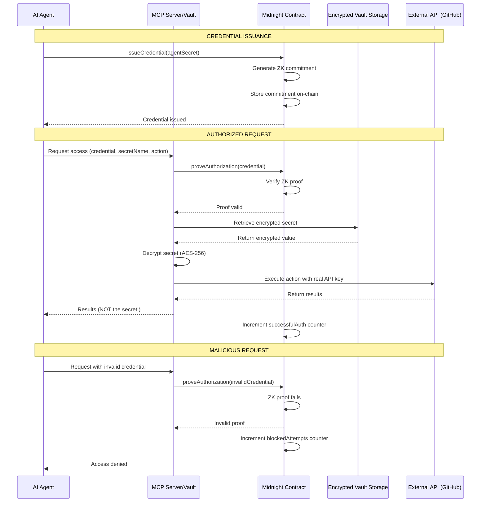

# Agent Vault - Verifiable Credential & Reputation Management

**ZK-Powered Verification System for AI Agents**

Built for Midnight Summit Hackathon 2025 • London, Nov 17-19

[](https://midnight.network)
[](https://opensource.org/licenses/MIT)

> **TL;DR**: Trustless verification and reputation management for AI agents. Prove capabilities through zero-knowledge credentials without revealing secrets. Build verifiable track records on blockchain.

---

https://github.com/user-attachments/assets/75db5afe-ada3-4cda-9991-3515289d7a77


## The Problem

As AI agents become more autonomous, three critical challenges emerge:

### 1. **Verification**: How do you verify an agent's capabilities?
- No trustless way to verify agent abilities
- Can't prove credentials without exposing secrets
- Centralized verification systems create trust bottlenecks

### 2. **Credential Management**: How do agents prove authorization?
- Agents need credentials to operate
- Traditional methods expose API keys to agents
- No privacy-preserving authorization mechanism

### 3. **Reputation**: How do agents build track records?
- No verifiable performance history
- Trust based on subjective ratings
- Centralized reputation systems are gameable

**Current solutions**: Centralized platforms, subjective reviews, exposed credentials
**Reality**: No trustless verification, privacy violations, unreliable reputation

---

## The Solution

**Agent Vault: Verifiable Credential & Reputation Management System**

First platform combining Midnight ZK proofs + verifiable credentials + reputation tracking to create **trustless agent verification**:

### Core Features:

1. **Verifiable Credentials** - Issue tamper-proof credentials on Midnight blockchain
2. **Reputation Management** - Track performance and build verifiable track records
3. **Zero-Knowledge Verification** - Prove capabilities without revealing secrets
4. **Privacy-Preserving Authorization** - Agents never see sensitive credentials
5. **Immutable Audit Trail** - All verifications logged on blockchain

### How It Works:

1. **Issue Credential** - Create immutable credential on blockchain
2. **Build Reputation** - Track successful authorizations and task completions
3. **Verify & Prove** - Generate zero-knowledge proofs of capabilities
4. **Access Resources** - Vault executes with credentials agent never sees
5. **Update Reputation** - Performance history builds trustworthiness

**Key Innovation:** Cryptographically verifiable reputation without exposing implementation details. Trustless verification through zero-knowledge proofs.

---

## Architecture



### Tech Stack

- **Blockchain**: Midnight Network (Testnet)
- **Smart Contracts**: Compact language (v0.18)
- **Encryption**: AES-256-CBC
- **MCP Server**: Model Context Protocol for AI agent integration
- **Database**: JSON file storage (production: PostgreSQL)

---

## Use Cases Enabled

### 1. Verifiable Autonomous Agents (VAA)
Agents prove they executed correctly:
- DeFi trading bots that prove they followed strategy
- DAO agents that prove they followed governance rules
- Compliance bots that prove they used correct model version
- On-chain investment advisors with verifiable execution

**Example**: "Agent X used Llama 3.1 to classify transaction as 'risky'" - provable on blockchain.

### 2. Private AI + Private Data
Agents operate on sensitive data without exposing it:
- Medical agents analyzing health records (HIPAA compliant)
- HR agents using confidential CV data
- Financial agents reading bank statements privately
- Legal agents working on privileged documents

**Example**: Agent analyzes medical records, returns diagnosis - doctor never sees raw data exposure.

### 3. Agent Identity & Attestation
ZK-based agent reputation and identity:
- Proof: "This agent belongs to verified developer" (without revealing developer)
- Agent passports and trust scores
- Preventing agent impersonation in A2A economies
- Verifiable agent credentials

**Example**: Agent proves it's authorized by enterprise customer without revealing which enterprise.

### 4. Compliance & Auditing
Satisfy regulators while preserving privacy:
- Prove GDPR/MiCA compliance without exposing data
- Demonstrate data access policies were followed
- Immutable audit trail on blockchain
- AML/KYC agents that prove they checked without exposing PII

**Example**: Agent proves it followed data retention policy - auditable by regulators, private to users.

### 5. Decentralized Agent Marketplaces
Trustless buying/selling of agent services:
- Buyers protect strategic data
- Sellers protect proprietary algorithms
- Verifiable work execution
- Automatic payment on proof of completion

**Example**: Buyer requests data analysis with private requirements, agent delivers verified results, payment released automatically.

**Total Addressable Market: $90B+** across enterprise AI security, Web3 agent economies, and privacy-preserving AI.

---

## 🏗️ Architecture

```
┌─────────────┐         ┌──────────────┐         ┌──────────┐
│ AI Agent    │────────>│  MCP Server  │────────>│ External │
│ (Claude)    │  "Get   │ (Vault Proxy)│  Uses   │ Service  │
│ + ZK Proof  │   data" │              │  Secret │ (GitHub) │
└─────────────┘         └──────────────┘         └──────────┘
                               ↓
                        ┌──────────────┐
                        │   Midnight   │
                        │   Contract   │
                        │  - Verifies  │
                        │    ZK proof  │
                        │  - Logs auth │
                        │  - Immutable │
                        └──────────────┘
                               ↓
                        Results (NO secret!)
                        + Audit Trail (on-chain)
```

### Tech Stack

- **Blockchain**: Midnight Network (Testnet)
- **Smart Contracts**: Compact language (v0.18)
- **Dashboard**: Next.js 14 + shadcn/ui + Tailwind CSS
- **Encryption**: AES-256-CBC
- **Database**: Neon PostgreSQL (serverless)
- **Deployment**: Vercel

---

## Quick Start

### Prerequisites

- Node.js 20+
- Docker (for Midnight proof server)
- Git

### Installation

```bash
# Clone the repository
git clone https://github.com/yourusername/agent-vault.git
cd agent-vault

# Install dependencies
npm install

# Configure environment variables
cp .env.example .env
# Edit .env and add your API keys (optional, only needed for two-agent demo)

# Start Midnight proof server (in separate terminal)
docker run -p 6300:6300 midnightnetwork/proof-server -- \
  'midnight-proof-server --network testnet'

# Compile the Compact contract
npm run compile

# Build TypeScript
npm run build
```

### Deploy Contract

```bash
npm run deploy
```

This will:
1. Create or use your wallet
2. Request testnet tokens (if needed)
3. Deploy the contract to Midnight testnet
4. Save deployment info to `deployment.json`

### Run Dashboard

```bash
cd dashboard
npm run dev
```

Dashboard available at: http://localhost:3000

---

## Available Commands

| Command | Description |
|---------|-------------|
| `npm run compile` | Compile Compact contract |
| `npm run build` | Build TypeScript files |
| `npm run deploy` | Deploy contract to Midnight testnet |
| `npm run cli` | Interactive CLI for contract operations |
| `npm run demo` | Run mocked agent simulation |
| `npm run demo:real` | **Run REAL demo** (actual Midnight + APIs) |

---

## Demo Scenarios

### Real Demo (`npm run demo:real`)

**100% real - not mocked!**

1. **Authorized Agent**
   - Agent needs GitHub data
   - Presents valid Midnight credential
   - Vault verifies on-chain
   - Makes real GitHub API call
   - Agent gets results (never sees API key)

2. **Malicious Agent**
   - Attempts SQL injection, brute force, etc.
   - All attacks blocked by ZK proof verification
   - Demonstrates infrastructure-enforced security

**What's Real:**
- Midnight blockchain verification
- AES-256 encryption/decryption
- Actual GitHub API calls
- Real-time stats

---

## Deployed Contract

**Network**: Midnight Testnet
**Address**: `02009ab82d5427c0f19872e5571f7b647ac0f75e3786027b8edfb0c629882bea1b5e`

**Circuits:**
- `issueCredential(agentSecret)` - Issue ZK credential to agent
- `proveAuthorization(agentSecret)` - Verify agent's credential
- `simulateAttack()` - Log blocked attack attempts

**Public Ledger State:**
- `totalCredentials` - Total credentials issued
- `successfulAuth` - Successful authorizations
- `blockedAttempts` - Attacks prevented

---

## Dashboard

Professional, minimal dashboard built with shadcn/ui:

- **Live Stats**: Credentials, auth attempts, blocked attacks
- **Contract Info**: Address, network, deployment time
- **Real-time Updates**: Auto-refresh every 10 seconds
- **Activity Feed**: Recent credential operations

**Design Philosophy**: Clean, minimal (like Vercel) - doesn't look AI-generated

---

## Project Structure

```
agent-vault/
├── contracts/
│   ├── agent-credentials.compact      # Midnight smart contract
│   └── managed/                        # Compiled contract artifacts
├── dashboard/                          # Next.js dashboard
│   ├── app/
│   │   ├── page.tsx                   # Main dashboard
│   │   └── api/stats/route.ts         # API endpoint
│   └── components/ui/                 # shadcn components
├── scripts/
│   ├── deploy.ts                      # Contract deployment
│   └── cli.ts                         # Interactive CLI
├── demo/
│   ├── agent-simulation.ts            # Mocked demo
│   └── agent-simulation-real.ts       # REAL demo
├── deployment.json                    # Contract address
└── .vault-secrets.json                # Encrypted vault storage
```

---


## License

MIT License - see LICENSE file

---

## Acknowledgments

- **Midnight Network** - For zero-knowledge infrastructure
- **shadcn/ui** - For beautiful, accessible components
- **Vercel** - For Next.js and deployment platform

---

## Contact

Built by the Keanu Klestil for Midnight Summit Hackathon 2025

**Questions?** Check the [docs](./docs/) or open an issue.

---

**This is the future of AI agent security.**

Agents can be helpful AND secure. They just need the right infrastructure.
